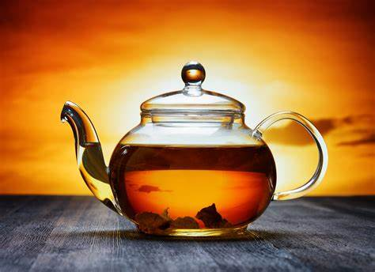
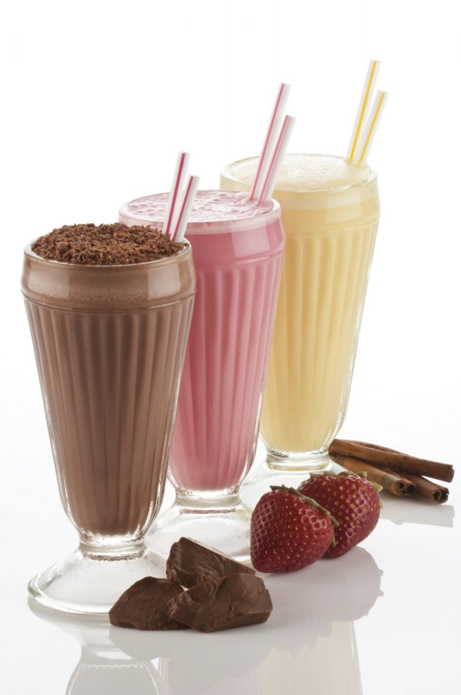

# ☕ The Beverage Hub

## Deployment Link
[Visit The Beverage Hub]

## 🎯 Key Features

### 1. Beverages Categorization  
The project categorizes different types of beverages into three main sections: **Tea, Coffee, and Shakes**. Each category contains **five varieties**, and every variety has its own page providing details about **ingredients, preparation steps, and health benefits**.

---

### 2. Responsive Navigation & Layout

#### **Flexbox Implementation:**
```css
nav {
  display: flex;
  justify-content: flex-end;
}

.container {
  display: flex;
  flex-wrap: wrap;
  justify-content: space-evenly;
}

body {
  display: flex;
  flex-direction: column;
  min-height: 100vh;
}
```
**Features:**
- Easy navigation between beverage categories.
- **Mobile-responsive** layout using **Flexbox**.
- Ensures a structured and clean interface.

---

### 3. Interactive Beverage Selection  
Users can explore different beverages using an **interactive grid layout** with hover effects.

#### **HTML Structure:**
```html
<div class="container">
    <a href="tea.html" class="box">
        
        <p class="bigFont">Tea</p>
    </a>
    <a href="coffee.html" class="box">
        
        <p class="bigFont">Coffee</p>
    </a>
    <a href="shake.html" class="box">
        
        <p class="bigFont">Shake</p>
    </a>
</div>
```
---

### 4. Hover Effects & Animations  
Each beverage box has smooth hover effects for better user interaction.

#### **CSS Styling:**
```css
.box {
    width: 200px;
    height: 250px;
    background: #fff;
    border-radius: 10px;
    box-shadow: 0px 4px 8px rgba(0, 0, 0, 0.2);
    padding: 10px;
    text-align: center;
    cursor: pointer;
    transition: transform 0.5s ease-in-out;
}

.box:hover {
    transform: translateY(-5px);
}
```
**Key Techniques:**
- **Smooth transitions** when hovering.
- **Box shadow and border-radius** for a modern UI.
- **Click interaction effects** for a better user experience.

---

### 5. Detailed Recipe Pages  
Each beverage has a **dedicated recipe page** listing ingredients, steps, and benefits.

#### **Example: Green Tea Page (green_tea.html)**
```html
<h2>Ingredients:</h2>
<ul>
    <li>Green tea leaves</li>
    <li>Hot water</li>
</ul>

<h2>Steps to Make Green Tea:</h2>
<ol>
    <li>Boil water and let it cool for a minute.</li>
    <li>Add green tea leaves to the hot water.</li>
    <li>Let it steep for 2-3 minutes.</li>
</ol>

<h2>Benefits of Green Tea:</h2>
<ul>
    <li>Rich in antioxidants.</li>
    <li>Boosts metabolism.</li>
    <li>Improves brain function.</li>
</ul>
```
**Features:**
- Step-by-step **structured recipe pages**.
- **Simple and readable** layout.
- Navigation links to go **back to categories**.

---

## 🖥️ Project Structure  
```
/pw-proj
 |-- index.html
 |-- styles.css
 |-- tea.html
 |-- coffee.html
 |-- shake.html
 |-- green_tea.html
 |-- black_tea.html
 |-- images/
    ├── tea.jpg
    ├── coffee.jpg
    ├── shake.jpg
    ├── green_tea.jpg
```

---

## 💻 Quick Start  
1. Clone the repository:  
   ```sh
   git clone https://github.com/ritik-pw/the-beverage-hub.git
   ```
2. Open **index.html** in a browser.

---

## 📝 License  
**MIT License** © 2025 The Beverage Hub  

📌 **Enjoy Exploring Beverages!** 🚀  
